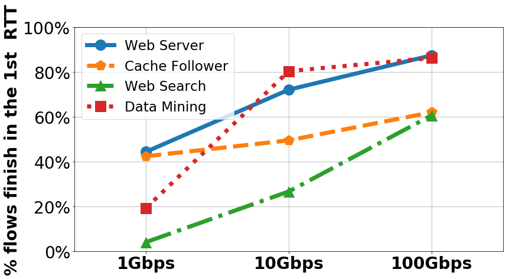

**Language:** python3

```phthon3
import matplotlib.pyplot as plt
import numpy as np
import matplotlib.ticker as ticker


plt.figure(figsize=(13,7))
ax = plt.gca()
ax.yaxis.set_major_formatter(ticker.PercentFormatter(xmax=1))

linkspeed = np.array(["1Gbps", "10Gbps", "100Gbps"])
plt.xticks(range(3), linkspeed, fontweight='bold')
plt.ylim([0, 1.00001])
plt.xlim([-0.5, 2.5])

y1 = np.loadtxt('fctWebServer.txt', delimiter=' ', unpack=True)
plt.plot(y1, label='Web Server', marker='o', markersize=18, linestyle= '-', linewidth=7.0)

y2 = np.loadtxt('fctCacheFollower.txt', delimiter=' ', unpack=True)
plt.plot(y2, label='Cache Follower', marker='p', markersize=18, linestyle= '--', linewidth=7.0)

y3 = np.loadtxt('fctWebSearch.txt', delimiter=' ', unpack=True)
plt.plot(y3, label='Web Search', marker='^', markersize=18, linestyle= '-.',linewidth=7.0)

y4 = np.loadtxt('fctDataMining.txt', delimiter=' ', unpack=True)
plt.plot(y4, label='Data Mining', marker='s', markersize=18, linestyle= ':',linewidth=7.0)

plt.xticks(fontsize=28)
plt.yticks(fontsize=28)
plt.ylabel('% flows finish in the 1st  RTT',fontsize=28, fontweight='bold')
plt.legend(fontsize=23, loc = 2)
plt.grid()
plt.show()
```