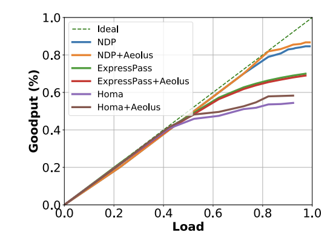

**Language:** python3

```phthon3
import matplotlib.pyplot as plt
import numpy as np

plt.figure(figsize=(9,7))
plt.xlim([0, 100]) # for web_search
#plt.xlim([0, 160]) # for data_mining
plt.ylim([0, 100])

x0 = [0, 100]
y0 = [0, 100]
plt.plot(x0,y0, label='Ideal',linestyle='--',linewidth=2.0,color='g')

x1, y1 = np.loadtxt('./goodput_ndp', delimiter=' ', unpack=True)
plt.plot(x1,y1, label='NDP',linestyle='-',linewidth=4.0,color='b')

x2, y2 = np.loadtxt('./goodput_ndp_aeolus', delimiter=' ', unpack=True)
plt.plot(x2,y2, label='NDP+Aeolus',linestyle='-',linewidth=4.0,color='r')

x3, y3 = np.loadtxt('./goodput_homa', delimiter=' ', unpack=True)
plt.plot(x3,y3, label='HOMA',linestyle='-',linewidth=4.0,color='b')

x4, y4 = np.loadtxt('./goodput_homa_aeolus', delimiter=' ', unpack=True)
plt.plot(x4,y4, label='HOMA+Aeolus',linestyle='-',linewidth=4.0,color='r')

plt.xticks(fontsize=24)
plt.yticks(fontsize=24)
plt.xlabel('Load (Gbps)',fontsize=24, fontweight='bold')
plt.ylabel('Goodput (Gbps)',fontsize=24, fontweight='bold')
plt.legend(fontsize=22,loc=2)
plt.grid()

plt.show()
```