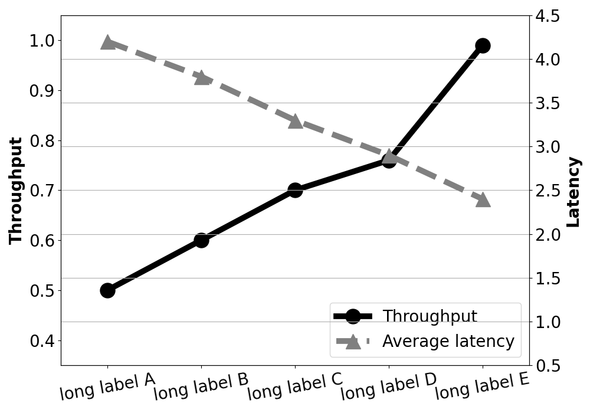

**Language:** python3

```phthon3
import matplotlib.pyplot as plt
import numpy as np
import matplotlib.ticker as ticker

fig, host = plt.subplots(figsize=(10,7))
par1 = host.twinx()

pattern=['long label A', 'long label B', 'long label C', 'long label D', 'long label E']
plt.xticks(range(len(pattern)), pattern, rotation=10)

host.set_ylim([0.35, 1.05])
par1.set_ylim([0.5, 4.5])
host.set_xlim([-0.5, len(pattern)-0.5])

thp = np.array([0.5,0.6,0.7,0.76,0.99])
lat = np.array([4.2,3.8,3.3,2.9,2.4])

p1, = host.plot(thp, marker='o', markersize=18, linestyle= '-', color='black',linewidth=7.0,label='Throughput')
p2, = par1.plot(lat, marker='^', markersize=18, linestyle= '--', color='gray', linewidth=7.0, label='Average latency')

host.tick_params(axis='x',labelsize=20, rotation=10)
host.tick_params(axis='y',labelsize=20)
par1.tick_params(axis='y',labelsize=20)
host.set_ylabel('Throughput',fontsize=20, fontweight='bold')
par1.set_ylabel('Latency',fontsize=20, fontweight='bold')
lines = [p1,p2]
host.legend(lines, [l.get_label() for l in lines], fontsize=20, loc=4)
plt.tight_layout()
plt.grid()
plt.show()
```