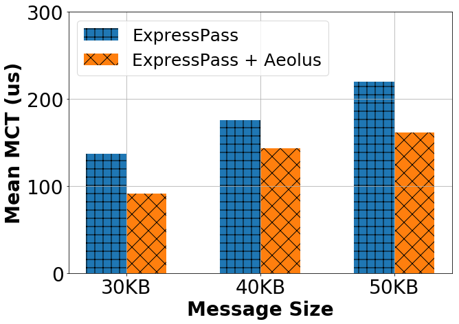

**Language:** python3

```phthon3
import matplotlib.pyplot as plt
import numpy as np
import matplotlib.ticker as ticker


fig = plt.figure(figsize=(10,7))
ax = fig.add_subplot(111)

ind = np.arange(3)
A = [140, 180, 220] # fake data here
B = [90, 140, 160] # fake data here

w = 0.3
ax.bar(ind-w/2, A, width=w, hatch='+', label='ExpressPass')
ax.bar(ind+w/2, B, width=w, hatch='x',label='ExpressPass + Aeolus')

ax.set_xticks(ind)
ax.set_xticklabels( ('30KB', '40KB', '50KB') )

plt.ylim([0, 300.01])
plt.xticks(fontsize=28)
plt.yticks(fontsize=28)
plt.yticks(np.arange(0, 350.00001, 100))
plt.ylabel('Mean MCT (us)',fontsize=28, fontweight='bold')
plt.xlabel('Message Size',fontsize=28, fontweight='bold')
plt.legend(fontsize=25, loc = 2)
plt.grid()

plt.show()
```

**Acknowledgement:** [@Shuihai HU](https://github.com/shuihaihu)