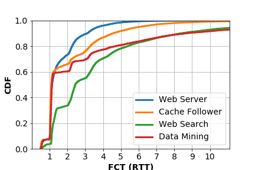

**Language:** python3

```phthon3
import matplotlib.pyplot as plt
import numpy as np

y1, x1 = np.loadtxt('a.txt', delimiter=' ', unpack=True)
y2, x2 = np.loadtxt('b.txt', delimiter=' ', unpack=True)
y3, x3 = np.loadtxt('c.txt', delimiter=' ', unpack=True)
y4, x4 = np.loadtxt('d.txt', delimiter=' ', unpack=True)
plt.xlim([0, 11.1])
plt.ylim([0, 1.00001])
plt.plot(x1,y1, label='Web Server',linewidth=3.0)
plt.plot(x2,y2, label='Cache Follower',linewidth=3.0)
plt.plot(x3,y3, label='Web Search',linewidth=3.0)
plt.plot(x4,y4, label='Data Mining',linewidth=3.0)

plt.xticks(fontsize=14)
plt.xticks(np.arange(1, 11, 1))
plt.yticks(fontsize=14)
plt.xlabel('FCT (RTT)',fontsize=14, fontweight='bold')
plt.ylabel('CDF',fontsize=14, fontweight='bold')
plt.legend(fontsize=14)
plt.grid()

plt.show()
```