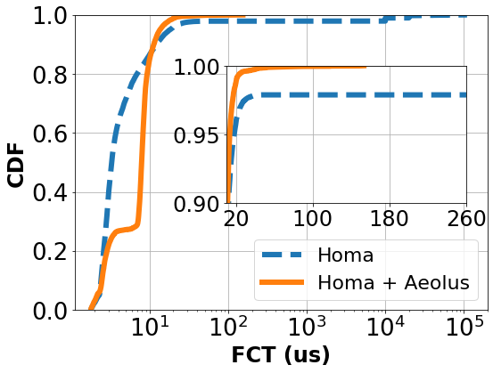

**Language:** python3

```phthon3
import matplotlib.pyplot as plt
import numpy as np

plt.figure(figsize=(8.3,6.1))

y1, x1 = np.loadtxt('a.txt', delimiter=' ', unpack=True)
plt.plot(x1,y1, label='Homa',linestyle='--',linewidth=6.0)
y2, x2 = np.loadtxt('b.txt', delimiter=' ', unpack=True)

plt.xlim([1.1, 200000])
plt.ylim([0, 1.00001])
plt.plot(x2,y2, label='Homa + Aeolus',linewidth=6.0)

plt.xticks(fontsize=26)
plt.xscale('log')
plt.yticks(fontsize=26)
plt.yticks(np.arange(0, 1.00001, 0.2))
plt.xlabel('FCT (us)',fontsize=24, fontweight='bold')
plt.ylabel('CDF',fontsize=24, fontweight='bold')
plt.legend(fontsize=22, loc=4)
plt.grid()

plt.axes([0.41, 0.4, .45, .35])
plt.plot(x1,y1,linestyle='--',linewidth=6.0)
plt.plot(x2,y2,linewidth=6.0)
plt.ylim(0.9, 1)
plt.xlim(10, 600)
plt.xticks(fontsize=24)
plt.yticks(fontsize=24)
plt.yticks(np.arange(0.9, 1.00001, 0.05))
plt.xticks(np.arange(20, 600, 200))
plt.grid()

plt.show()
```